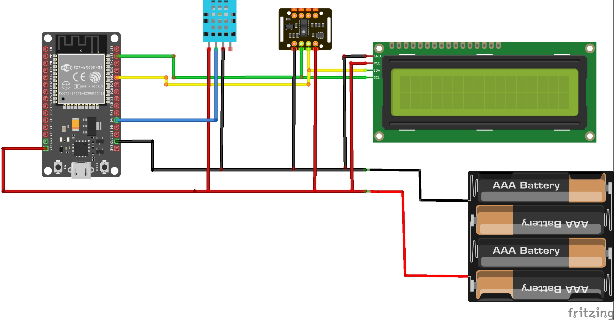

# Health Monitoring System using ESP32

**Overview**
This project aims to build a health monitoring system that reads vital health parameters such as BPM (Beats per Minute), 
SpO2 (Blood Oxygen Saturation), temperature, and humidity. The system uses the ESP32 as the central microcontroller, 
and various sensors are integrated for real-time monitoring.

**The sensors used are:**

 - MAX30102: For measuring BPM and SpO2.
 - DHT22: For measuring temperature and humidity.
 - I2C LCD: For displaying the data in a readable format.
 - The data is displayed on an I2C LCD, and it allows users to monitor their health in real time.

**Components Used**

 - ESP32 Dev Board: Main microcontroller for interfacing the sensors.
 - MAX30102: A sensor to measure heart rate (BPM) and blood oxygen saturation (SpO2).
 - DHT22: A temperature and humidity sensor.
 - I2C LCD: To display real-time readings of health parameters.
 - Jumper Wires: For making connections between components.

**Features**

 - Displays BPM, SpO2, temperature, and humidity on an I2C LCD.
 - Real-time monitoring of health parameters.
 - Wireless connectivity (Wi-Fi) using ESP32 (optional feature for cloud connectivity).
 - Easy-to-use and compact design.

**Circuit Diagram**

Below is the general circuit connection:

MAX30102:

VCC -> 5V
GND -> GND 
SDA -> GPIO 21 (ESP32)
SCL -> GPIO 22 (ESP32)
DHT22:

VCC -> 5V
GND -> GND 
DATA -> GPIO 23 (ESP32)
I2C LCD:

VCC -> 5V 
GND -> GND 
SDA -> GPIO 21 (ESP32)
SCL -> GPIO 22 (ESP32)

**Libraries Used**

 - Wire.h: For I2C communication with the LCD.
 - Adafruit_Sensor.h: For interfacing with the MAX30102 sensor.
 - MAX30105.h: MAX30102 sensor library to measure BPM and SpO2.
 - DHT.h: For reading temperature and humidity from the DHT22 sensor.
 - LiquidCrystal_I2C.h: For controlling the I2C LCD.

**Software Requirements**

 - Arduino IDE: To program the ESP32 board.
 - ESP32 Board Package: Make sure the ESP32 board package is installed in the Arduino IDE.
 - Libraries:
   - Adafruit_Sensor
   - MAX30105
   - DHT
   - LiquidCrystal_I2C
   - Wire
